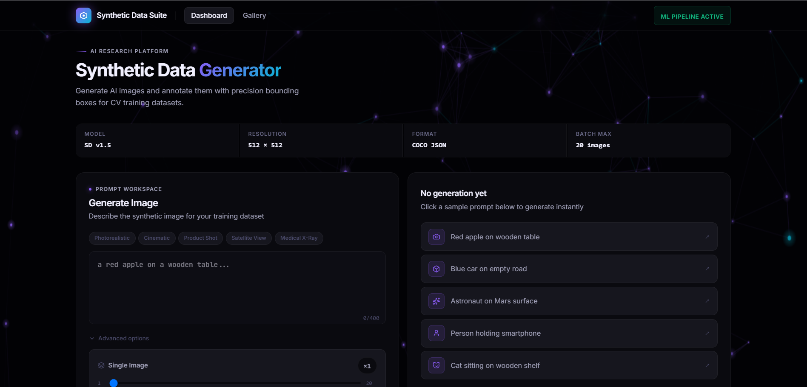

<div align="center">

# Synthetic Data Suite

### AI platform for synthetic image generation and CV dataset annotation



</div>

---

## What is this?

The **Synthetic Data Suite** is a full-stack AI research platform that automates
the creation of labeled computer vision training datasets from scratch.

```
Text Prompt → AI Image Generation → Bounding Box Annotation → Dataset Export
```

This mirrors the workflow used by ML teams at scale — a generative model creates
synthetic training data, a detection model auto-labels it, a human reviews and
approves, and the dataset is exported to any ML framework format.

---

## Architecture

```
┌─────────────────┐     HTTP      ┌──────────────────────────────┐
│   Next.js 15    │ ────────────► │      FastAPI Backend         │
│   TypeScript    │               │                              │
│   Tailwind CSS  │               │  ┌────────────────────────┐  │
│   Framer Motion │               │  │    Celery Worker       │  │
│                 │               │  │    (Async Task Queue)  │  │
│  Dashboard      │               │  └──────────┬─────────────┘  │
│  Gallery        │               │             │                │
│  Annotation     │               │  ┌──────────▼─────────────┐  │
│  Studio         │               │  │    ML Pipeline         │  │
│  Batch Gen      │               │  │                        │  │
└─────────────────┘               │  │  SD v1.5  (local GPU)  │  │
                                  │  │  SD 3.5   (Replicate)  │  │
                                  │  │  YOLOv8n  (CPU)        │  │
                                  │  └────────────────────────┘  │
                                  │                              │
                                  │  SQLite + Redis              │
                                  └──────────────────────────────┘
```

---

## Features

### Image Generation
- Local inference via **Stable Diffusion v1.5** on consumer GPU (4GB VRAM)
- Cloud inference via **SD 3.5 Large Turbo** (Replicate API)
- **Batch generation** — up to 20 images simultaneously
- **Real-time step tracking** — inner denoising loop progress written to DB every 2 steps
- **Quality boost** — automatic prompt enhancement and negative prompting
- **Style presets** — Photorealistic, Cinematic, Product Shot, Satellite View, Medical X-Ray
- **Mock mode** — instant placeholder images for testing without GPU

###  Annotation Studio
- Interactive canvas with click-and-drag bounding boxes
- **Coordinate scaling** — canvas coordinates auto-scaled to real image pixel space
- **AI Auto-Label** — YOLOv8-nano detects objects with confidence scores
- Approve/reject individual AI predictions before saving
- Right-click to delete, hover tooltips showing real pixel dimensions
- Session persistence via `localStorage` — survives navigation and browser refresh

###  Multi-Format Export

| Format | Framework |
|---|---|
| COCO JSON | PyTorch, Detectron2, MMDetection |
| YOLO .txt | Ultralytics YOLOv8, normalized 0–1 coords |
| Pascal VOC XML | TensorFlow Object Detection API, OpenCV |
| CSV | Excel, Pandas, data analysis |

All formats bundled with source images in a structured ZIP.

###  Dataset Gallery
- Persistent image database — survives page refresh
- Filter by generation status
- Dataset statistics and storage estimates
- One-click annotate, download, or delete per image

---

## Engineering Highlights

| Challenge | Solution |
|---|---|
| Long GPU inference blocking API | Celery async task queue — API returns `task_id` instantly |
| UI shows no progress during generation | Step callback writes denoising progress to DB every 2 steps |
| Batch state lost on page navigation | Active task IDs persisted to `localStorage` with 4hr TTL |
| Canvas boxes wrong size on different screens | `real_coord = canvas_coord ÷ (canvas_px ÷ image_px)` |
| Model reloading between requests | Module-level singleton — loaded once per Celery worker |
| Replicate rate limiting in batch mode | Tasks staggered by `index × 12s` before firing |

---

## Tech Stack

| Layer | Technology |
|---|---|
| Frontend | Next.js 15, TypeScript, Tailwind CSS, Framer Motion |
| Backend | FastAPI, SQLAlchemy, Pydantic, SQLite |
| Task Queue | Celery 5.4, Redis 7 |
| ML — Generation | Stable Diffusion v1.5 (HuggingFace diffusers) |
| ML — Detection | YOLOv8-nano (Ultralytics) |
| Canvas | Native HTML5 Canvas API |
| Export | JSZip (client), Python zipfile (server) |

---

## The Coordinate Scaling Problem

The most critical detail in the annotation system:

```
Raw image:    512 × 512 px  ← ground truth, stored in DB
Canvas:       720 × 720 px  ← what the user sees

Scale factor = canvas_width / image_width = 720 / 512 = 1.406

User draws box at canvas (100, 100) size (80 × 80)

Saved to DB as:
  x = 100 / 1.406 = 71.1 px  ← real image coordinates
  y = 100 / 1.406 = 71.1 px
  w = 80  / 1.406 = 56.9 px
  h = 80  / 1.406 = 56.9 px
```

Exported annotations are pixel-accurate regardless of screen resolution or zoom.

---

<div align="center">

**Built by [Reeva Kanakhara](https://github.com/ReevaKanakhara)**

*Data Science & ML Student · IoT & Deep Learning*

</div>
